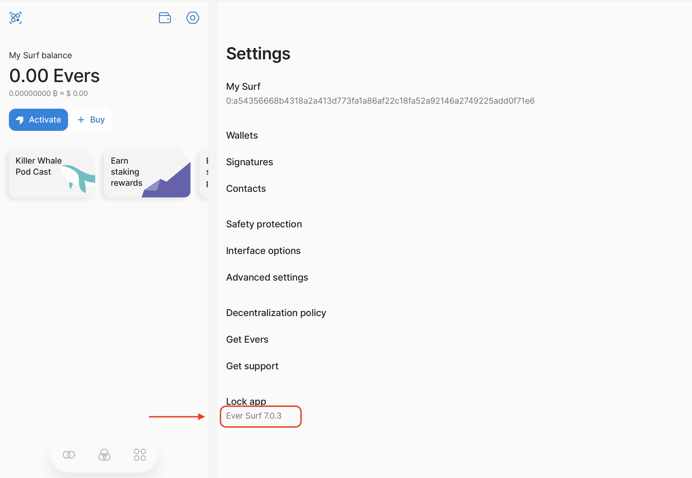

# Guide for Localization in GitHub

All localization files of the Surf app are stored on GitHub. You need a GitHub account to access them. If you haven’t previously used GitHub, please [create one](https://github.com/signup?ref_cta=Sign+up&ref_loc=header+logged+out&ref_page=%2F&source=header-home).

## Create a repository copy

All changes to the strings you make in your own repository without affecting the original TON Surf repository. This step is performed only once, you don't need to create a copy of repository every time you want to edit strings.

1. Go to the [TON-Surf-Localization](https://github.com/tonlabs/TON-Surf-Localization) repository.
   
2. In the upper right corner, click **Fork**.
   
3. Click you local repository name. GitHub will copy the TON-Surf-Localization repository there. 
   

Well done! Now you have a copy of the TON-Surf-Localization repository and you are ready to edit string files.

Do not close the tab. We recommend you to add this webpage to your Favourites or Bookmarks in your browser to easily revisit it later.

## Switch to the right branch

It's extremely important to edit strings in the latest version of file. Otherwise, your changes can cause conflicts when merging them.
First, please check the current Surf version number. Then, switch to the Github branch with the same number to get the file latest version.

1. Open [Surf for Translators](https://ton-surf-translate.firebaseapp.com/). If opening for the fist time, please comply with legal requirements as described in the [Help Center](https://help.ever.surf/en/support/solutions/articles/77000236686-do-i-need-to-register-to-use-surf-).
2. On the main screen, click the Settings icon.
   
3.  At the bottom of the screen, find the Surf current version number.
   
4. If you closed the browser tab with your local repository on GitHub, please reopen it.
5. Click on the branch name and enter the version number you found at [Surf for Translators](https://ton-surf-translate.firebaseapp.com/).
   
6. If there is no appropriate branch in the list, create it the following way:
   
   a. Enter the branch name starting from the "surf@" and containing the Surf version number. For example, surf@6.6.9
   b. Click **Create branch**.
7. Click **Fetch upstream** and click **Fetch and merge**.
   

## Open file for edit

All localization files are stored in the **src** folder. Every localization file named according to the two-letter country code.

You can edit files right in GitHub or download them to your computer and edit locally.

### Edit on GitHub

1. In your local repository, switch to the right branch.
3. Click the **src** folder.
4. Click on the file you want to edit.
5. Click the pencil icon.
   

The file opens in GitHub build-in editor.

### Download file

1. In your local repository, switch to the right branch.
3. Click the **src** folder.
4. Click on the file you want to edit.
5. Right-click the **Raw** button and select **Download Linked File**.
   
   The name of the context menu varies from the browser you use.

File downloaded on your computer. Now you can open it with any editor supporting JSON format. For example, VSCode or Notepad++

## Check a string ID

Sometimes different strings can have the same translation. To know exactly what string you change, you can enable the Localization Helper in the Surf app.

1. Open [Surf for Translators](https://ton-surf-translate.firebaseapp.com/).
2. In the upper left corner, click the Surf icon.
3. Select **Advanced settings**.
4. Select **Language**.
5. Click **Enable localization helper**.

Now, when you put the cursor in the string, its ID is displayed above the screen.

Every ID consists of keys separated with commas. Knowing the string ID you can search the localization file for keys and find the string you need. For example, the string ID **TON-Surf.setup.promoCards.faq.initial** consists of the following keys:  

## Commit changes

Once you're satisfied with your work, you can open a pull request to merge the changes in your repository into TON-Surf-Localization.

1. Scroll down to the end of the file editor page.
2. Click **Commit changes**.

If you make translations locally, copy changed strings. Then, open a file for edit in GitHub and paste changes there.

## Create Pull Request

Pull Request allows you to merge your changes to the original repository. When creating the pull request follow these rules:

-   Create one Pull Request for one language. If you edit two or more languages, create separate Pull Requests.
-   Pull Requests are accepted only for the latest version of the application.

Make sure that your changes correspond to the JSON format. You can use, for example, <https://jsonformatter.curiousconcept.com/>

1. Open the **Pull Requests** tab.
   
2. Click **New pull request**.
   
3. In the **Compare changes** section, verify you're going to commit changes to the branch of the same name.
   
4. Click **Create pull request**.
   
5. Enter a title and describe the changes.
6. Tag people who you want to review these changes by mentioning their usernames, for example, @AnnStepanova. List of reviewers you can check here.
   
7. Click **Create pull request**.

As you aren’t a member of Team Surf, you’ll see the following message after creating pull request:

Don’t worry, people you’ve mentioned will receive notifications to review and take a look at your changes.

Your changes appear in the app within a few weeks after the approval and acceptance of the Pull Request.

## Subscribe to updates

To receive notifications when strings changed and you need to take part in review, you need to set up participating notifications in GitHub.

1. In the upper-right corner of the page, click your profile photo, then select **Settings**.
   
2. In the **Account settings** menu, select **Notifications**.
3. 
4. In the **Participating** section, select how you want to receive notifications: **Email** or **Web and Mobile**.
   

Now, you never miss strings changes that require your attention. When someone @mentions your username, you get it right away: receive an email with a link to view changes or see the icon badge next to the 🔔.

If you faced problems setting notifications, you can learn more about notifications at [GitHub Docs](https://docs.github.com/en/account-and-profile/managing-subscriptions-and-notifications-on-github/setting-up-notifications/configuring-notifications).

## Review and approve changes

When someone asks you to review updated strings, you can give the green light to the changes or ask the author to improve translations.

1. Open notification where you were mentioned as a reviewer.
2. Go to the **Files changed** tab.
   
3. Review edited strings. If you want to discuss changes with its author, you can leave comments by clicking **+** next to the string number.
   
4. If edited strings have no mistakes, click **Review changes**.
   
5. Select **Approve** and click **Submit review**.
   
