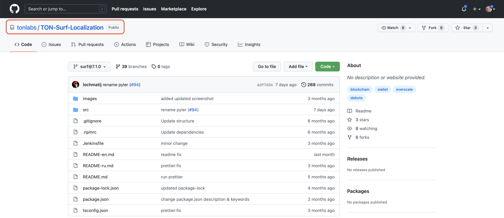
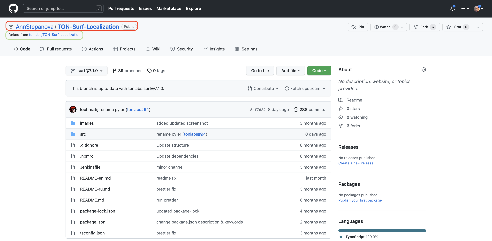

# Как вести локализацию в GitHub

<<<<<<< HEAD
# Локализация проекта [TON-Surf](https://ton.surf)

В этом репозитории размещены файлы локализации проекта TON-Surf.

## Формат файлов
=======
Все файлы локализации Сёрфа хранятся на GitHub. Для доступа к ним вам нужна учетная запись GitHub. Если вы ранее не использовали GitHub, пожалуйста, [создайте ее](https://github.com/signup?ref_cta=Sign+up&ref_loc=header+logged+out&ref_page=%2F&source=header-home).

## Копирование репозитория

Все изменения строк вносятся в файлы в вашем репозитории, чтобы не затрагивать исходный репозиторий TON-Surf-Localization.

1. Перейдите в репозиторий локализации [TON-Surf-Localization](https://github.com/tonlabs/TON-Surf-Localization).
   
2. В правом верхнем углу нажмите на кнопку **Fork**.
   
3. Выберите, куда GitHub скопирует репозиторий локализации TON-SURF.

Теперь у вас есть копия репозитория, и вы можете вносить изменения в строки локализации.

>>>>>>> development

Простая структура в формате [JSON](https://ru.wikipedia.org/wiki/JSON)

## Подготовка

1. [Зарегистрируйтесь](https://github.com/signup) или [войдите](https://github.com/login) на GitHub.
2. Перейдите в проект [TON-Surf-Localization](https://github.com/tonlabs/TON-Surf-Localization)
3. Нажмите кнопку **Fork**, которая расположена в правом верхнем углу, сделав таким образов ответвление проекта.

<<<<<<< HEAD
## Редактирование файла перевода
=======
1. Нажмите на файл, который вы хотите отредактировать.
2. Нажмите на значок карандаша.
   
>>>>>>> development

### Редактирование на GitHub

1. Откройте нужный языковой файл нажав на [него](https://github.com/tonlabs/TON-Surf-Localization/tree/development/src)
2. Нажмите на иконку редактирования в форме карандаша, расположенную в верхнем правом углу
3. Сделайте нужные изменения в файле.

<<<<<<< HEAD
### Редактирование на компьютере
=======
1. Нажмите на файл, который вы хотите отредактировать.
2. Щелкните правой кнопкой мыши по кнопке **Raw** и выберите **Загрузить связанный файл**.
   
   Название контекстного меню зависит от используемого вами браузера.
>>>>>>> development

1. Откройте нужный языковой файл нажав на него
2. Скачайте файл нажав правую кнопку мыши на кнопке **Raw**, расположенную в верхнем правом углу, и выбрав **Сохранить**
3. Откройте скачанный файл в текстовом редакторе с поддержкой JSON.
4. Сделайте нужные изменения в файле.

### Нахождение строки для перевода

Воспользуйтесь один из 2 способов:

<<<<<<< HEAD
-   Поиском по содержимому строки в файле перевода (удобно когда строка большая или уникальная)
-   **Через веб-приложение TON-Surf**  
    В [веб-приложении TON-Surf](https://beta.ton.surf) есть помощник локализатора - он показывает полный путь до нужной строчки при наведении на неё.
    Его можно включить, перейдя по следующему пути - **Настройки - Расширенные настройки - Язык - Включить помощь в локализации**

## Отправка перевода
=======
1. Откройте [Surf for Translators](https://ton-surf-translate.firebaseapp.com/).
2. В левом верхнем углу нажмите на значок Сёрфа.
3. Выберите **Дополнительные настройки**.
4. Выберите **Язык**.
5. Нажмите **Включить помощника по локализации**.

Теперь, когда вы помещаете курсор на строку, ее идентификатор будет отображаться в верхней части экрана.

>>>>>>> development

### Отправка перевода на GitHub

1. Нажмите кнопку **Commit changes**.

<<<<<<< HEAD
### Отправка перевода на компьютере
=======
1. Прокрутите страницу вниз до конца
2. Нажмите на кнопку **Commit changes**.
>>>>>>> development

1. Выполните первые два пункта в разделе **"Редактирование на GitHub"**
2. Скопируйте содержимое файла из текcтового редактора внутрь окна редактирования.
3. Нажмите кнопку **Commit changes**.

## Создание запроса на изменение файла локализации

<<<<<<< HEAD
### Правила создания

-   Pull Requests принимается только на перевод одного языка.
-   Для двух и более языков нужно сделать разные pull requests.
-   PR принимаются только для последней версии приложения.
-   Для принятия pull request нужно подтверждению минимум 3 проверяющих.

### Создание запроса на слияние (Pull Request)

1. Убедитесь что ваши изменения соответствуют формату JSON. Например [здесь](https://jsonformatter.curiousconcept.com/).
2. Выберите вкладку Pull requests.
3. Нажмите New pull request.
4. Нажмите Create pull request.
5. Введите заголовок, опишите изменения.
6. Нажмите кнопку Create pull request.

**Внимание! Изменения которые вы вносите, появятся в приложении в течение нескольких недель после одобрения и принятия PR.**
=======
Запрос на слияние (Pull Request) позволяет перенести изменения из вашего репозитория в репозиторий локализации TON-Surf-Localization. При создании запроса следуйте этим правилам:

-   Создавайте один запрос для одного языка. Если вы редактируете два или более языков, создайте отдельные запросы для каждого.
-   Запросы принимаются только для последней версии файлов.

1. Перейдите на вкладку **Pull Request**.
   
2. Нажмите **New pull request**.
   
3. Нажмите **Create pull request**.
   
4. Введите название и опишите изменения.
5. Отметьте людей, которые должны подтвердить ваши изменения. Список ревьюиров вы можете посмотреть здесь.
   
6. Нажмите **Create pull request**.

Поскольку вы не являетесь членом Team Surf, после создания запросы вы увидите следующее сообщение:

Все в порядке. Пользователи, которых вы отметили, получат уведомления об изменениях, внесенных вами.

Изменения появятся в приложении через несколько недель после подтверждения запроса на слияние.

## Подписка на обновления

Чтобы вовремя получать уведомления об измененных строках и принимать участие в ревью переводов, вам нужно настроить Participating уведомления в GitHub.

1. В правом верхнем углу страницы нажмите на фото профиля и выберите **Settings**.
   
2. В меню **Account settings** выберите **Notifications**.
3. 
4. В блоке **Participating** выберите, как вы хотите получать уведомления: **Email** или **Web and Mobile**.
   

Теперь вы точно не пропустите изменений, требующих вашего внимания. Когда кто-то отметит вас по имени пользователя, вы сразу получите уведомление.

## Ревью и подтверждение изменений

Когда вас просят поучаствовать в ревью переводов, от вас зависит дать изменениям "зеленый свет" или попросить их автора что-то еще поправить.

1. Откройте уведомление, в котором вас отметили в качестве ревьюера.
2. Перейдите на закладку **Files changed**.
   
3. Просмотрите измененные строчки. Если у вас возникли вопросы по переводу или вы нашли ошибку в тексте, вы можете оставить комментарий к строке следующим образом:
   a) Справа от номера строки нажмите **+**.
   
   b) Укажите свой комментарий и нажмите Add single comment.
     
4. Когда все замечания будут учтены, а ошибки исправлены, нажмите **Review changes**.
   
5. Выберите **Approve** и нажмите **Submit review**.
   
>>>>>>> development
